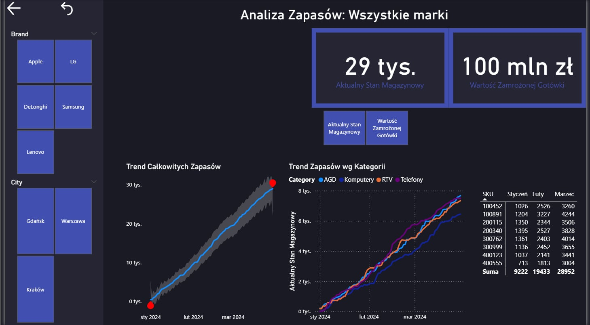
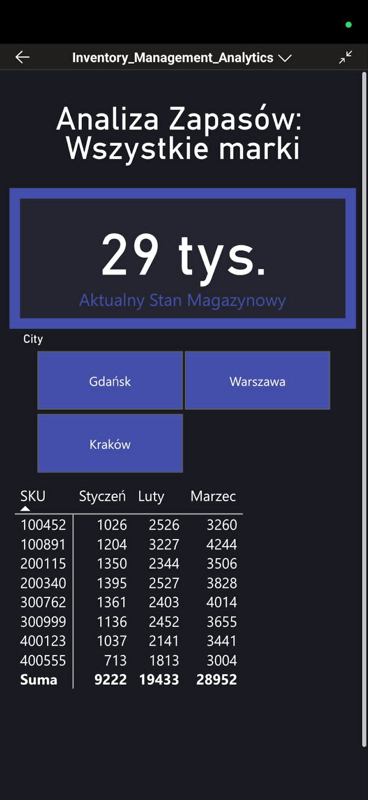
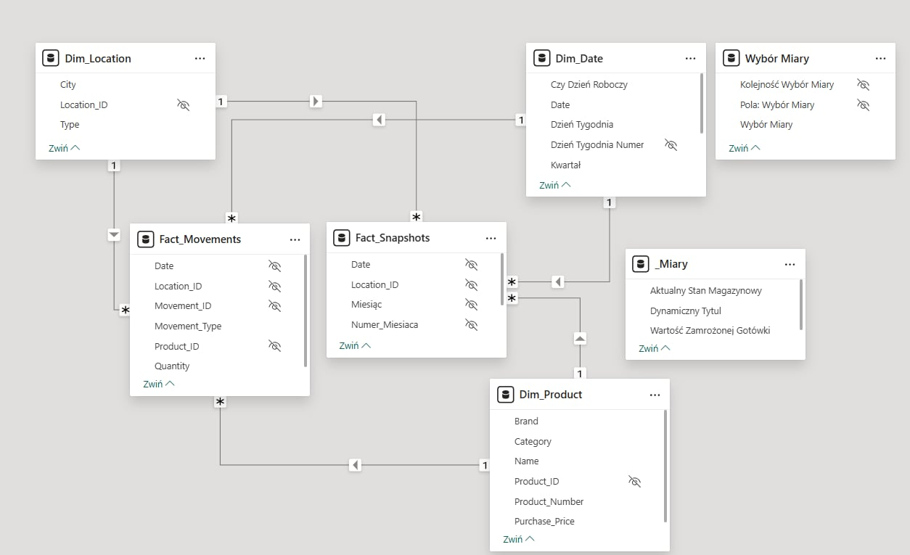
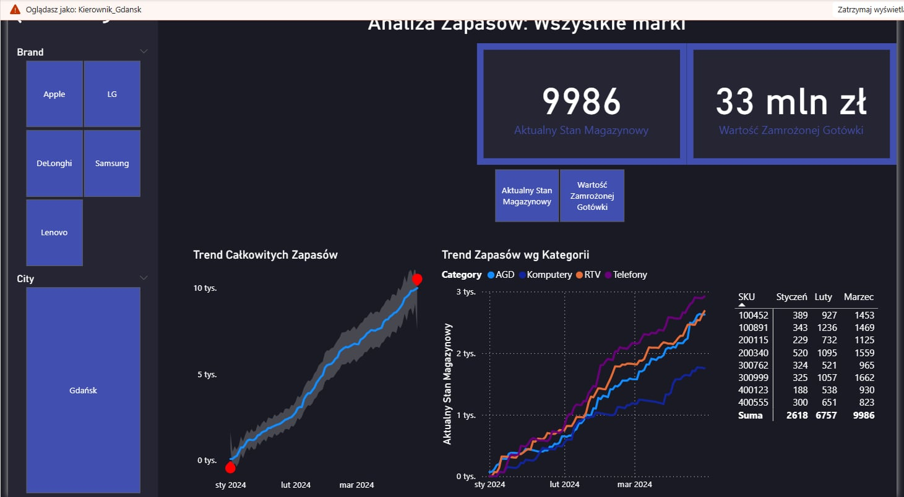
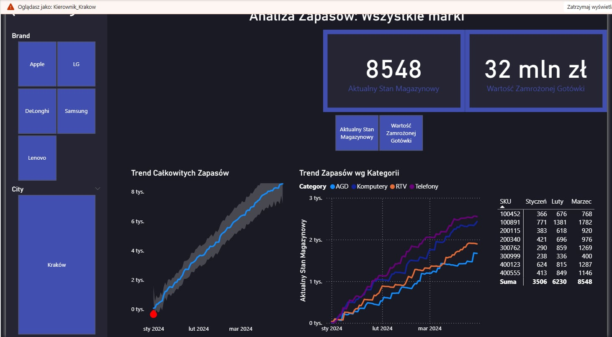

# Power BI Inventory Management Analytics

Power BI inventory management dashboard featuring a Mobile-First design, Row-Level Security (RLS), and Star Schema data model.

## Project Overview
I built this project to solve a real business problem I noticed: manual verification of product availability across different systems takes too much time. I wanted to apply the analytical thinking I am developing during my Artificial Intelligence studies to create a practical, data-driven solution. This Power BI dashboard is designed to monitor inventory levels and optimize the process of checking stock. I focused heavily on a Mobile-First approach so that users can quickly verify SKU availability directly from their phones.

## Key Features
- Mobile Interface: I designed a dedicated, responsive vertical layout optimized for quick smartphone lookups.
- Row-Level Security (RLS): I implemented dynamic data filtering based on user roles. Regional Managers for Gdańsk, Warszawa, and Kraków can only access data specific to their locations.
- Dynamic KPIs: The dashboard automatically calculates Current Stock Levels and the Frozen Capital Value.
- Accessibility: I configured a logical Tab Order to fully support keyboard navigation.

## Technical Details
### Data Model
I structured the data using a clean Star Schema to ensure optimal reporting performance:
- Fact Tables: Fact_Movements, Fact_Snapshots
- Dimension Tables: Dim_Product, Dim_Location, Dim_Date
- Optimization: I hid technical and surrogate keys from the report view and organized all measures in a dedicated folder to keep the model clean.

### DAX Implementation
In this project, I used advanced DAX calculations, including:
- Time Intelligence: Month-over-month inventory trend tracking.
- Dynamic Titles: Chart titles that automatically update based on the selected slicers.
- Measure Swapping: A feature that allows the user to switch between Volume (Quantity) and Value (PLN) dynamically on the dashboard.

## Dashboard Preview

**Interactive Demo (Tooltips & Drill-through):**

**Main Dashboard View:**

**Mobile Interface:**

**Data Model (Star Schema):**

**Row-Level Security (RLS) - Gdańsk vs Kraków:**

